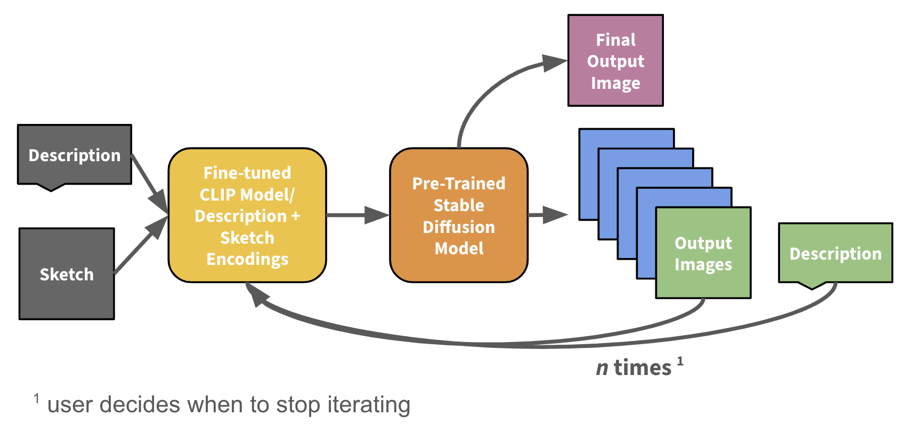

# Welcome to Sketchy!

## Overview
This project is a Flask-based web application that uses generative AI to create and refine police sketch images. By combining structured suspect descriptions with generative models like CLIP, users can iteratively refine sketches through feedback, enabling more accurate visual representations of suspects.

## Features
- **Survey Input**: Collect detailed descriptions of a suspect's appearance via structured forms, including information about gender, age, body build, facial features, and distinguishing characteristics.

- **AI-Generated Sketches**: Combines OpenAI's CLIP model and Stable Diffusion to generate initial police sketch images from descriptive text summaries. CLIP encodes the text descriptions into embeddings, which guide the Stable Diffusion model to produce realistic sketches.

- **Interactive Refinement**: Enables iterative refinement of generated sketches. Users provide additional feedback prompts (e.g., "Make the nose smaller" or "Add glasses"), which are encoded using CLIP and combined with the original text embeddings to guide Stable Diffusion in refining the images.

- **Database Integration**: Uses SQLite to store user information, structured survey responses, generated images, and refinement history. This ensures all data is associated with a specific user session for seamless interaction and retrieval.


## Workflow Diagram
  

## Installation and Setup

### Step 1: Install Required Packages
Ensure you have Python installed on your system. Then, install the required packages by running the following command:

```
pip install -r requirements.txt
```

### Step 2: Set Up the Database
Create the SQLite tables by running:

```
python tables.py
```

## Running the program
Start the program with:

```
python run.py
```

